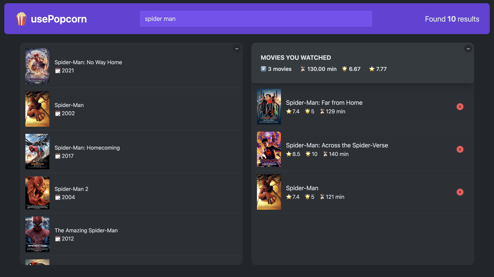

# 🍿 usePopcorn — Movie Discovery Platform

**usePopcorn** is a modern and responsive movie discovery platform built to explore, rate, and save your favorite movies. This project showcases my skills in building interactive web applications with a focus on user experience, API integration, and clean code.

## ✨ Highlights

- 🎬 **Movie Exploration:** Search for any movie, view ratings, and add your own ratings using a public movie API.
- 💾 **Local Storage:** Save your favorite movies and ratings directly in the browser's local storage.
- 📱 **Responsive Design:** Fully responsive UI, optimized for mobile, tablet, and desktop devices.
- 🚀 **Deployed Live:** The project is live on Vercel (or another platform, if applicable).

## 🛠 Tech Stack

- **React.js**
- **TypeScript**
- **Tailwind CSS**
- **JavaScript (ES6+)**
- **Vercel** for deployment
- **Public Movie API (e.g., OMDb API)**

## 📦 Features

- Search movies by title with real-time results
- Add movies to your favorites list
- View and add ratings for movies
- Persist favorites and ratings in local storage
- Mobile-first, fully responsive design
- Smooth and intuitive user interface

## 🔗 Live Demo
👉 View Project on Vercel

👉 [View Project on Vercel](https://use-popcorn-iota-pearl.vercel.app/)  

## 👨‍💻 My Role

I developed this project as a **solo developer**, focusing on:

- Integrating a public movie API for dynamic data fetching
- Building a responsive and user-friendly interface
- Implementing local storage for persisting user data
- Writing clean, type-safe code with TypeScript

## 🧪 Getting Started (Optional)

To run usePopcorn locally, follow these steps:

